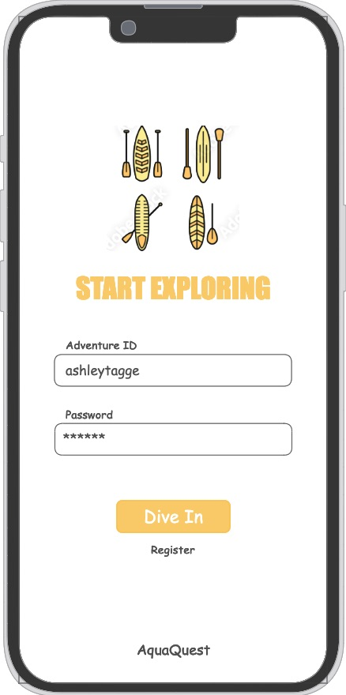
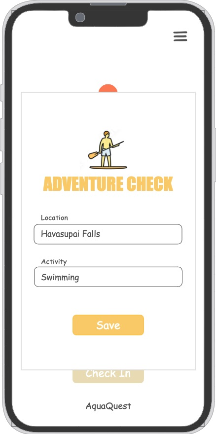
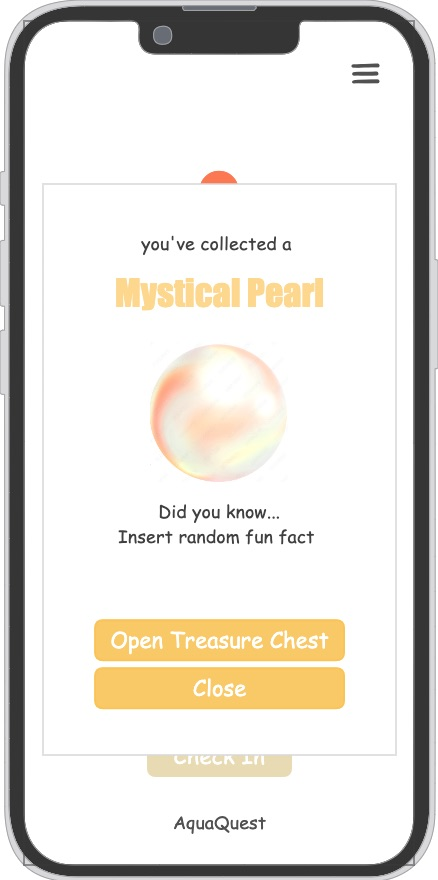

# AquaQuest

[My Notes](notes.md)

AquaQuest concept:  
Explore a virtual map that unlocks as you check in at real-world water locations. Each check-in reveals hidden treasures or rare aquatic creatures to earn points and badges. Earn points to compete with friends in an online leaderboard.

> [!NOTE]
>  This is a template for your startup application. You must modify this `README.md` file for each phase of your development. You only need to fill in the section for each deliverable when that deliverable is submitted in Canvas. Without completing the section for a deliverable, the TA will not know what to look for when grading your submission. Feel free to add additional information to each deliverable description, but make sure you at least have the list of rubric items and a description of what you did for each item.

> [!NOTE]
>  If you are not familiar with Markdown then you should review the [documentation](https://docs.github.com/en/get-started/writing-on-github/getting-started-with-writing-and-formatting-on-github/basic-writing-and-formatting-syntax) before continuing.

## 🚀 Specification Deliverable

> [!NOTE]
>  Fill in this sections as the submission artifact for this deliverable. You can refer to this [example](https://github.com/webprogramming260/startup-example/blob/main/README.md) for inspiration.

For this deliverable I did the following. I checked the box `[x]` and added a description for things I completed.

- [x] Proper use of Markdown
- [x] A concise and compelling elevator pitch
- [x] Description of key features
- [x] Description of how you will use each technology
- [x] One or more rough sketches of your application. Images must be embedded in this file using Markdown image references.

### Elevator pitch

Imagine turning every paddleboarding, boating, or swimming adventure into an exciting outdoor quest with Aquaquest! Our app incentivizes real-world water activities by unlocking a vibrant virtual map as users explore their favorite spots, discover hidden treasures, and encounter rare aquatic creatures. With features like interactive leaderboards, personalized progress trackers, and real-time friend updates, AquaQuest fosters a vibrant community of water enthusiasts eager to compete and collaborate. Seamlessly blending engaging gameplay with practical tracking, AquaQuest makes every outing fun, motivates users to explore more, and helps them connect deeper with their aquatic passions. Join us in revolutionizing outdoor adventures and making every splash count!

### Design

Here is what a user might see when they check in at an outdoor location.

The user and the users friends will get a notification when they check in at a location. The User's may look light the following:

### Key features

**PREFACE** - These features sound simple to me now but may be simplified even further in the next few weeks.

1. Check-Ins Unlock the Map
- Users unlock new areas on the map by checking in at paddleboarding, swimming, or boating locations. 
- Use tracking to store location data. 
- Use mapping to display the different locations you've visited.
2. Treasure Collection
- Every check in randomly rewards a treasure that counts as points towards a users total progress.
- Treasures could include a pearl, golden paddle, shells, or aquatic creatures.
- Treasures are saved to the users personal treasure inventory in the directory.
3. Friends Leaderboard
- Users earn points for every check-in, unique check-ins, and treasures that they earn.
- Points are tracked and compared with friends' scores using a simple leaderboard. 
4. Progress Tracker
- A visual progress bar tracks the users total amount of points that they've received from check-ins and treasures.
- The progress bar rewards badges for every 100 points earned. An example may be the Wilderness Explorer Badge or an Ocean Adventurer Badge.
- Every badge is a milestone.

### Technologies

I am going to use the required technologies in the following ways.

- **HTML** - Use to create pages/sections. Have a login plage that allow users to register and log in. Have a main game page that displays a virtual map, treasure inventory, leaderboard, and progress bar. I'll use <header>, <main>, <section>, and <footer> for structure.
- **CSS** - Style my web application to be visualing appealing, responsive, and cutsie. Make custom styles for the map, treasures with animations, and the leaderboard progress bar. Have some bounce, fade in, or glowing effects. Try to make it responsive for mobile and web versions.
- **React** - I will use react to create the reusable components for the map, leaderboard, and treasure inventory. In other words, the interactive and dynamic components. Specifically, it will render the virtual map and tracks how users interact with it. It will also display the top users and the treasures the a user has collected. The react router library will help navigation from login to the main game page.
- **Service** - I'm going to use this for a fun aspect. There is a Ocean Facts API that can provide random marine life fact or image everytime a user earns a treasure.
- **Internal Service** -  Dynamically update the user's progress bar and ensure that it accurately reflects the number of treasures collected and locations checked in.
- **DB/Login** - The application will need a database to store usernames/passwords and track the check-ins at locations a user has visted. It will also save the treasures collected.
- **WebSocket** - I will use WebSocket to broadcast news to the others users. For example, a user will be allerted when someone passes them on the leaderboard.

## 🚀 AWS deliverable

For this deliverable I did the following. I checked the box `[x]` and added a description for things I completed.

- [x] **Server deployed and accessible with custom domain name** - [My server link](https://yourdomainnamehere.click).

**AWS Notes**
- my AWS Account ID is 762233738401
- My IP address is 3.209.173.176
- I created an elastic IP address. Do not forget to RELEASE it after the semester is over.
- I am using a t2.nano instance.
- Use this command line to shell into the server ssh -i ~/desktop/keys/ashspen815.pem ubuntu@3.209.173.176
- Use this command line to access information in the server ls -l
**My URLs**
- https://startup.aquaquest.click
- https://simon.aquaquest.click
- https://aquaquest.click

## 🚀 HTML deliverable

For this deliverable I did the following. I checked the box `[x]` and added a description for things I completed.

- [x] **HTML pages** - I did complete this part of the deliverable.
- [x] **Proper HTML element usage** - I did complete this part of the deliverable.
- [x] **Links** - I did complete this part of the deliverable.
- [x] **Text** - I did complete this part of the deliverable.
- [x] **3rd party API placeholder** - I did complete this part of the deliverable.
    - My 3rd party API placeholder is the image of a mermaid tail, and other filler images, on the treasure.hmtl and treasure_box.html pages. The API FishPicRandomizer will replace these images with a random fish for each check in reward.
- [x] **Images** - I did complete this part of the deliverable.
    - The images on the index.html and checkin.html pages are going to be included in the application. I used an image on the map.html page to demonstrate what the map will look like when I am able to implement CSS styling.
- [x] **Login placeholder** - I did complete this part of the deliverable.
    - login placeholders are on index.html
- [x] **DB data placeholder** - I did complete this part of the deliverable.
    - My DB data placeholder is on the leaderboard.html page that shows the scores of the user and their friends. There is another on the treasure_box.html page where it remembers all of the treasures that the user has earned and displays them there. It will also remember who the users friends are and display a friends list.
- [x] **WebSocket placeholder** - I did complete this part of the deliverable.
    - The placeholders are the scores on the leaderboard.html pages. I'll use websocket to update the leaderboard based off of real time high scores of friends that are also using the application. Rather that just displaying the users last high score, it will be dynamic and update scores after users check in and earn more points.

**Practice HMTL CodePens**
Structure: https://codepen.io/ashleytagge/pen/GgKwyep
Input: https://codepen.io/ashleytagge/pen/emOQyoK
Media: https://codepen.io/ashleytagge/pen/azoQqzM
Simon HTML Short Cut: https://www.youtube.com/watch?v=zg7eDNRMnWA

./deployFiles.sh -k ~/desktop/keys/ashspen815.pem -h aquaquest.click -s simon

**Application data:** A simple png image showing what the map will look like when we add the css components, and how the shapes will fill with each check in. A check in button that redirects you to a check in page. An add friend button. The navigation menu.
**Authentication:** An input for the user to create an account and login. Display the user's name after they login.
**Database data:** A rendering of application data that is stored in the database. For AquaQuest this is storing the scores of the user and the users friends to be showed on a leaderboard. And showing all the locations/treasures the user has collected in the treasure box. It is also going to store animal creature names in the database to assign to the randomly generated fish images provided by the api we will implement later on.
**WebSocket data:**  Realtime data sent from other users (e.g. chat or scoring data), or realtime data that your service is generating (e.g. stock prices or latest high scores). For Aquaquest, I'm going to simplify how I'm going to use WebSocket. Instead of sending players a notification when they are passed on the leaderboard, it will simply keep the leaderboard updated based on recent high scores received by my server. It was also add treausures to the treasure box when it recieves the real time data that is submitted when a user checks in at a new location.

## 🚀 CSS deliverable

**PLEASE NOTE**
- I have not been able to sync my vscode files to github all week. I have been getting an error saying, "warning: ignoring ref with broken name refs/heads/main 2". I FINALLY fixed it today (I honestly don't know how I did it either) and it rewrote all of my previous commitment descriptions as "Fixing branches so I can commit to github". I apologize that all of the commit notes are now extremley vague. My new commits will be descriptive and hopefully I don't have any more issues with github.

For this deliverable I did the following. I checked the box `[x]` and added a description for things I completed.

- [x] **Header, footer, and main content body** - I not complete this part of the deliverable.
    -navigation bar is my header, the main content is the body, the footer contains my named and my github link
- [x] **Navigation elements** - I did complete this part of the deliverable.
    -this was a pain in the butt, but I did complete this part of the deliverable! I am proud of myself for this part!
- [x] **Responsive to window resizing** - I did complete this part of the deliverable.
    -it is responsive to window resizing. I made sure to include the <meta name="viewport" content="width=device-width, initial-scale=1.0"> tag on each html page and tested it by resizing my window.
- [x] **Application elements** - I did complete this part of the deliverable.
    -I made the map! I switched the last shape of the map to a larger circle because i couldn't get a star to work. I tried overlapping three triangles and it was insane, maybe I'll add that back in later.
- [x] **Application text content** - I did complete this part of the deliverable.
    -I included all the text I will include in the final application.
- [x] **Application images** - I did complete this part of the deliverable.
    -This is what I am MOST proud of! I played around with images and animations and the treasure chest page ended up being super cool because of it. 

**Random Notes**
- The API will be implemented through the checkin notifications. A random ocean fact will appear with the numbers of points they were awarded.
- Establish a more diverse color palette if there is time because right now everything is orange.
- Think of a way to make the map page more exciting. I could add an animation in the background.

**Practice Code**
- Link to CSS Practice: https://codepen.io/ashleytagge/pen/qEWGGgo
- Link to responsive design CodePen: https://codepen.io/leesjensen/pen/NWzLGmJ
- Link to display properties (blocking with 
): https://codepen.io/leesjensen/pen/RwBOPjv
- Link to Grid: https://codepen.io/leesjensen/pen/GRGXoWP
    - Use for treasure box page!!!
- Link to practice responsive page: https://codepen.io/ashleytagge/pen/NPKVQzB
- CSS Frameworks practice: https://codepen.io/ashleytagge/pen/pvzmMOY
- ./deployFiles.sh -k ~/keys/production.pem -h yourdomain.click -s simon

## 🚀 React part 1: Routing deliverable

For this deliverable I did the following. I checked the box `[x]` and added a description for things I completed.

- [x] **Bundled using Vite** - I did complete this part of the deliverable.
- [x] **Components** - I did complete this part of the deliverable.
- [x] **Router** - Routing between login and voting components.

-I spent an hour completing the 3 checkboxes described above and probably 10+ hours fixing my css.

## 🚀 React part 2: Reactivity 

For this deliverable I did the following. I checked the box `[x]` and added a description for things I completed.

- [x] **All functionality implemented or mocked out** - I did not complete this part of the deliverable.
    - This was so exciting! All functionality is implemented or mocked out. There are placeholders that allow you to interact with it as if it were calling an api or storing information in a database.
    - If you're reading this go test it out! Some of my favorite feautures are adding friends and exploring the treasure box. You can add anybody as a friend right now and the program will assign them a random number of points to compare to yours on the leaderboard. The leaderboard will automatically update as you check in to more places! When you check in to a location on the map you will earn points, and get to enter where and what you were doing outside. Make sure to visit the treausure box after a couple of check ins because it keeps track of what you've been doing in order of when you did it!
    - If you want to clear all of the data you have inputed while testing, just return to the login page and sign in as a different user. It will reset everything for you as if you were a new player.
- [x] **Hooks** - I did not complete this part of the deliverable.
    - I implemented useEffect and useState hooks to track points, the current username, and other user input across multiple webpages. For example, my map page calculates the number of points the user earns and that information is update using states. The state is updated when more points are earned. Then, I was able to access that data and display it on my leaderboard page.

## 🚀 Service deliverable

For this deliverable I did the following. I checked the box `[x]` and added a description for things I completed.

- [ ] **Node.js/Express HTTP service** - I did not complete this part of the deliverable.
- [ ] **Static middleware for frontend** - I did not complete this part of the deliverable.
- [ ] **Calls to third party endpoints** - I did not complete this part of the deliverable.
- [ ] **Backend service endpoints** - I did not complete this part of the deliverable.
- [ ] **Frontend calls service endpoints** - I did not complete this part of the deliverable.

## 🚀 DB/Login deliverable

For this deliverable I did the following. I checked the box `[x]` and added a description for things I completed.

- [ ] **User registration** - I did not complete this part of the deliverable.
- [ ] **User login and logout** - I did not complete this part of the deliverable.
- [ ] **Stores data in MongoDB** - I did not complete this part of the deliverable.
- [ ] **Stores credentials in MongoDB** - I did not complete this part of the deliverable.
- [ ] **Restricts functionality based on authentication** - I did not complete this part of the deliverable.

## 🚀 WebSocket deliverable

For this deliverable I did the following. I checked the box `[x]` and added a description for things I completed.

- [ ] **Backend listens for WebSocket connection** - I did not complete this part of the deliverable.
- [ ] **Frontend makes WebSocket connection** - I did not complete this part of the deliverable.
- [ ] **Data sent over WebSocket connection** - I did not complete this part of the deliverable.
- [ ] **WebSocket data displayed** - I did not complete this part of the deliverable.
- [ ] **Application is fully functional** - I did not complete this part of the deliverable.
