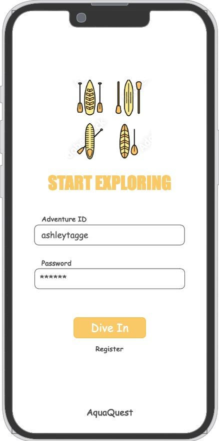
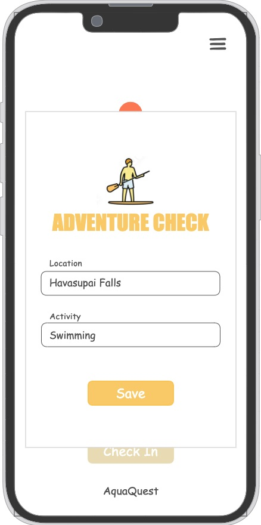
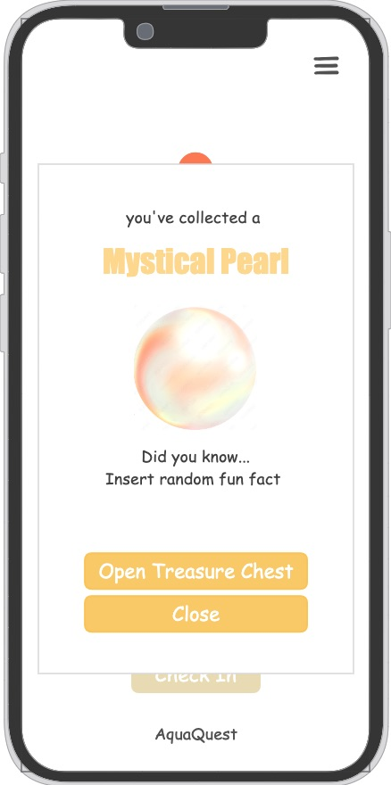

# AquaQuest

[My Notes](notes.md)

AquaQuest concept:  
Explore a virtual map that unlocks as you check in at real-world water locations. Each check-in reveals hidden treasures or rare aquatic creatures to earn points and badges. Earn points to compete with friends in an online leaderboard.

> [!NOTE]
>  This is a template for your startup application. You must modify this `README.md` file for each phase of your development. You only need to fill in the section for each deliverable when that deliverable is submitted in Canvas. Without completing the section for a deliverable, the TA will not know what to look for when grading your submission. Feel free to add additional information to each deliverable description, but make sure you at least have the list of rubric items and a description of what you did for each item.

> [!NOTE]
>  If you are not familiar with Markdown then you should review the [documentation](https://docs.github.com/en/get-started/writing-on-github/getting-started-with-writing-and-formatting-on-github/basic-writing-and-formatting-syntax) before continuing.

## 🚀 Specification Deliverable

> [!NOTE]
>  Fill in this sections as the submission artifact for this deliverable. You can refer to this [example](https://github.com/webprogramming260/startup-example/blob/main/README.md) for inspiration.

For this deliverable I did the following. I checked the box `[x]` and added a description for things I completed.

- [x] Proper use of Markdown
- [x] A concise and compelling elevator pitch
- [x] Description of key features
- [x] Description of how you will use each technology
- [x] One or more rough sketches of your application. Images must be embedded in this file using Markdown image references.

### Elevator pitch

Imagine turning every paddleboarding, boating, or swimming adventure into an exciting outdoor quest with Aquaquest! Our app incentivizes real-world water activities by unlocking a vibrant virtual map as users explore their favorite spots, discover hidden treasures, and encounter rare aquatic creatures. With features like interactive leaderboards, personalized progress trackers, and real-time friend updates, AquaQuest fosters a vibrant community of water enthusiasts eager to compete and collaborate. Seamlessly blending engaging gameplay with practical tracking, AquaQuest makes every outing fun, motivates users to explore more, and helps them connect deeper with their aquatic passions. Join us in revolutionizing outdoor adventures and making every splash count!

### Design

Here is what a user might see when they check in at an outdoor location.

The user and the users friends will get a notification when they check in at a location. The User's may look light the following:

### Key features

**PREFACE** - These features sound simple to me now but may be simplified even further in the next few weeks.

1. Check-Ins Unlock the Map
- Users unlock new areas on the map by checking in at paddleboarding, swimming, or boating locations. 
- Use tracking to store location data. 
- Use mapping to display the different locations you've visited.
2. Treasure Collection
- Every check in randomly rewards a treasure that counts as points towards a users total progress.
- Treasures could include a pearl, golden paddle, shells, or aquatic creatures.
- Treasures are saved to the users personal treasure inventory in the directory.
3. Friends Leaderboard
- Users earn points for every check-in, unique check-ins, and treasures that they earn.
- Points are tracked and compared with friends' scores using a simple leaderboard. 
4. Progress Tracker
- A visual progress bar tracks the users total amount of points that they've received from check-ins and treasures.
- The progress bar rewards badges for every 100 points earned. An example may be the Wilderness Explorer Badge or an Ocean Adventurer Badge.
- Every badge is a milestone.

### Technologies

I am going to use the required technologies in the following ways.

- **HTML** - Use to create pages/sections. Have a login plage that allow users to register and log in. Have a main game page that displays a virtual map, treasure inventory, leaderboard, and progress bar. I'll use <header>, <main>, <section>, and <footer> for structure.
- **CSS** - Style my web application to be visualing appealing, responsive, and cutsie. Make custom styles for the map, treasures with animations, and the leaderboard progress bar. Have some bounce, fade in, or glowing effects. Try to make it responsive for mobile and web versions.
- **React** - I will use react to create the reusable components for the map, leaderboard, and treasure inventory. In other words, the interactive and dynamic components. Specifically, it will render the virtual map and tracks how users interact with it. It will also display the top users and the treasures the a user has collected. The react router library will help navigation from login to the main game page.
- **Service** - I'm going to use this for a fun aspect. There is a Ocean Facts API that can provide random marine life fact or image everytime a user earns a treasure.
- **DB/Login** - The application will need a database to store usernames/passwords and track the check-ins at locations a user has visted. It will also save the treasures collected.
- **WebSocket** - I will use WebSocket to broadcast news to the others users. For example, a user will be allerted when someone passes them on the leaderboard.

## 🚀 AWS deliverable

For this deliverable I did the following. I checked the box `[x]` and added a description for things I completed.

- [x] **Server deployed and accessible with custom domain name** - [My server link](https://yourdomainnamehere.click).

**AWS Notes**
- my AWS Account ID is 762233738401
- My IP address is 3.209.173.176
- I created an elastic IP address. Do not forget to RELEASE it after the semester is over.
- I am using a t2.nano instance.
- Use this command line to shell into the server ssh -i ~/desktop/keys/ashspen815.pem ubuntu@3.209.173.176
- Use this command line to access information in the server ls -l

## 🚀 HTML deliverable

For this deliverable I did the following. I checked the box `[x]` and added a description for things I completed.

- [ ] **HTML pages** - I did not complete this part of the deliverable.
- [ ] **Proper HTML element usage** - I did not complete this part of the deliverable.
- [ ] **Links** - I did not complete this part of the deliverable.
- [ ] **Text** - I did not complete this part of the deliverable.
- [ ] **3rd party API placeholder** - I did not complete this part of the deliverable.
- [ ] **Images** - I did not complete this part of the deliverable.
- [ ] **Login placeholder** - I did not complete this part of the deliverable.
- [ ] **DB data placeholder** - I did not complete this part of the deliverable.
- [ ] **WebSocket placeholder** - I did not complete this part of the deliverable.

## 🚀 CSS deliverable

For this deliverable I did the following. I checked the box `[x]` and added a description for things I completed.

- [ ] **Header, footer, and main content body** - I did not complete this part of the deliverable.
- [ ] **Navigation elements** - I did not complete this part of the deliverable.
- [ ] **Responsive to window resizing** - I did not complete this part of the deliverable.
- [ ] **Application elements** - I did not complete this part of the deliverable.
- [ ] **Application text content** - I did not complete this part of the deliverable.
- [ ] **Application images** - I did not complete this part of the deliverable.

## 🚀 React part 1: Routing deliverable

For this deliverable I did the following. I checked the box `[x]` and added a description for things I completed.

- [ ] **Bundled using Vite** - I did not complete this part of the deliverable.
- [ ] **Components** - I did not complete this part of the deliverable.
- [ ] **Router** - Routing between login and voting components.

## 🚀 React part 2: Reactivity

For this deliverable I did the following. I checked the box `[x]` and added a description for things I completed.

- [ ] **All functionality implemented or mocked out** - I did not complete this part of the deliverable.
- [ ] **Hooks** - I did not complete this part of the deliverable.

## 🚀 Service deliverable

For this deliverable I did the following. I checked the box `[x]` and added a description for things I completed.

- [ ] **Node.js/Express HTTP service** - I did not complete this part of the deliverable.
- [ ] **Static middleware for frontend** - I did not complete this part of the deliverable.
- [ ] **Calls to third party endpoints** - I did not complete this part of the deliverable.
- [ ] **Backend service endpoints** - I did not complete this part of the deliverable.
- [ ] **Frontend calls service endpoints** - I did not complete this part of the deliverable.

## 🚀 DB/Login deliverable

For this deliverable I did the following. I checked the box `[x]` and added a description for things I completed.

- [ ] **User registration** - I did not complete this part of the deliverable.
- [ ] **User login and logout** - I did not complete this part of the deliverable.
- [ ] **Stores data in MongoDB** - I did not complete this part of the deliverable.
- [ ] **Stores credentials in MongoDB** - I did not complete this part of the deliverable.
- [ ] **Restricts functionality based on authentication** - I did not complete this part of the deliverable.

## 🚀 WebSocket deliverable

For this deliverable I did the following. I checked the box `[x]` and added a description for things I completed.

- [ ] **Backend listens for WebSocket connection** - I did not complete this part of the deliverable.
- [ ] **Frontend makes WebSocket connection** - I did not complete this part of the deliverable.
- [ ] **Data sent over WebSocket connection** - I did not complete this part of the deliverable.
- [ ] **WebSocket data displayed** - I did not complete this part of the deliverable.
- [ ] **Application is fully functional** - I did not complete this part of the deliverable.
